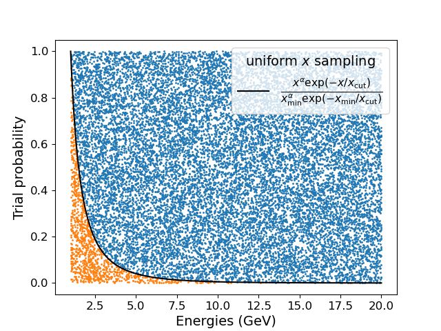
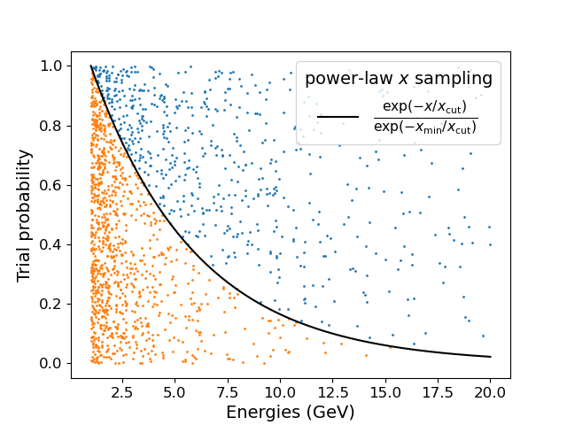
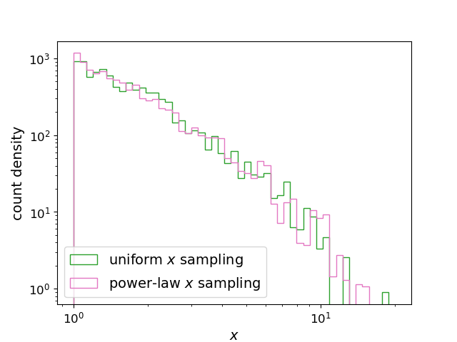
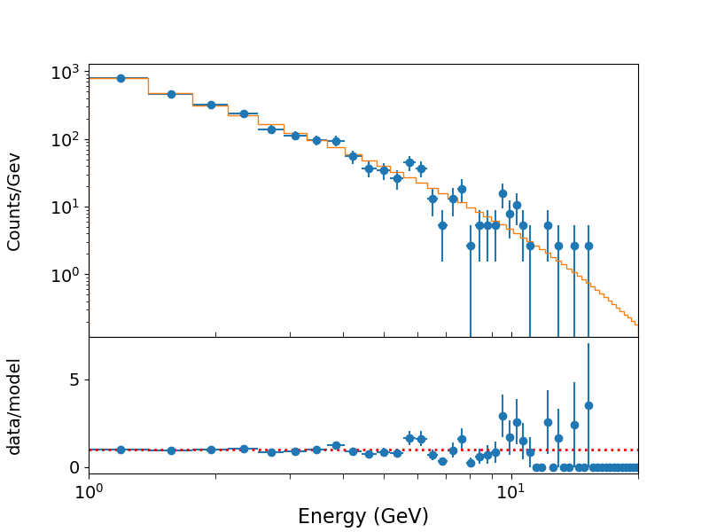
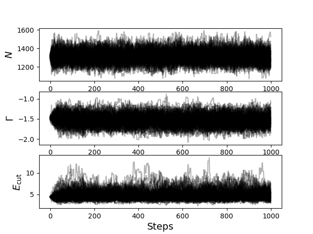
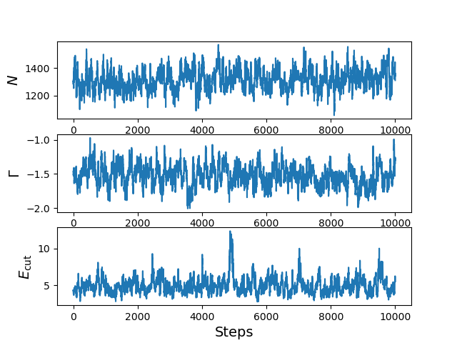
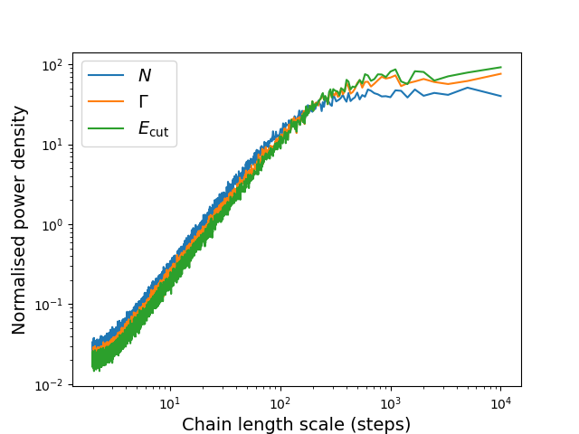
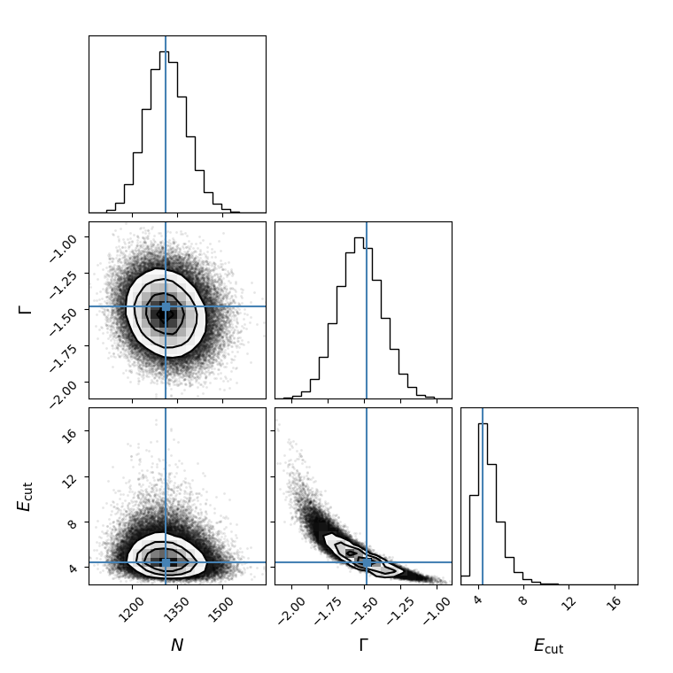

<script src="../code/math-code.js"></script>
<!-- Just one possible MathJax CDN below. You may use others. -->
<script async src="//mathjax.rstudio.com/latest/MathJax.js?config=TeX-MML-AM_CHTML">
</script>

## Dealing with difficult distributions

In many cases we would like to be able to constrain and ideally sample from a probability distribution, which requires knowledge of the integral of the distribution, so we can calculate the cdf (e.g. to estimate confidence intervals) or its inverse, in order to generate random samples from the distribution. Or we might want to determine a marginal pdf, e.g. to calculate the posterior probability of some interesting parameter. 

In all these cases and many others, it may be easy to calculate the pdf, but integrating it can be much more difficult and time-consuming if e.g. a brute force grid search or numerical integration of a multi-parameter distribution is required. A solution is to reduce the number of calculations required by random sampling over the distribution. This will lead us to consider one of the most powerful tools for scientific inference: Markov Chain Monte Carlo (MCMC). 

## A simple approach: the accept-reject method

Sampling from a distribution is commonly used to generate random numbers. A random number drawn from a $$U(0,1)$$ distribution corresponds to a percentile in the cdf of any other distribution. If the cdf for a given distribution can be inverted (to obtain the point-percent function or ppf), the uniform variate we drew can be converted directly into a corresponding random number sampled from that new distribution. However, often it isn't easy (or it may be impossible) to obtain the ppf from a distribution, e.g. if the integration of the pdf, or the inversion of the cdf are difficult.

A simple solution to this problem is the accept-reject method, which can in principle be used to sample random numbers from any distribution $$f(x)$$ where the probability is bounded (or approximately bounded) by finite values of $$x$$. A typical approach to generate a sample of $$n$$ random variates is as follows:
1. First, sample a trial random number from a known distribution to determine the $$x$$ value, $$x_{\rm try}$$.
2. Calculate $$f(x)$$ and determine the ratio $$f(x_{\rm try})/{\rm max}(f(x))$$, where $$\mbox{max}(f(x))$$ is the maximum value of the function. Now generate a uniform ($$U(0,1)$$) variate $$p_{\rm try}$$. If $$p_{\rm try}\leq f(x_{\rm try})/{\rm max}(f(x))$$ the trial $$x_{\rm try}$$ is accepted as a random variate drawn from $$f(x)$$. Otherwise $$x_{\rm try}$$ is discarded.
3. Repeat steps 1 and 2 until $$n$$ random variates from $$f(x)$$ have been accepted.

Although this approach can generate random numbers very flexibly for any given distribution, it can be very inefficient if the random variates $$x_{\rm try}$$ and $$p_{\rm try}$$ used to sample from the distribution are not well-matched to its shape. For example, consider the case where we would like to sample random variates in the range $$x_{\rm min}$$ to $$x_{\rm max}$$, from a probability distribution given by a power-law with an exponential cut-off at large values of $$x$$:

$$p(x)\propto x^{\alpha}\exp(-x/x_{\rm cut})$$

This distribution is challenging both to integrate and invert the integral (to obtain the ppf). However, with the accept-reject method the function we can use is simply the right-hand side of the proportionality, i.e. $$f(x)=x^{\alpha}\exp(-x/x_{\rm cut})$$ - we do not need to normalise it so that the probability integrates to 1, as any normalisation factor is removed in step 2 of the method. The accept-reject method ensures that the random variates of any sample-size are samples from the distribution.

Let's look at some simple code where in step 1 we sample from $$U(x_{\rm min},x_{\rm max})$$ to obtain $$x_{\rm try}$$:

```python
import numpy as np
import scipy.stats as sps

def plexp(x,alpha,xcut):
    '''Power-law function with index alpha an exponential cut-off with scaling factor xcut'''
    return (x**alpha)*np.exp(-x/xcut)

def sample_plexp_ucdf(nsamp,xmin,xmax,alpha,xcut):
    '''Accept-reject sampling of function f(x) which is a power-law with exponential cut-off. 
    Trial x values are drawn from a uniform distribution U[xmin,xmax]. Trial probabilities are 
    drawn from U[0,1] and accepted if p<=f(x)/f(xmin) (f(xmin) is a maximum assuming negative 
    PL index).'''
    xvals = np.zeros(nsamp)
    i = 0
    ntry = 0
    ymax = plexp(xmin,alpha,xcut)  # Requires alpha to be negative
    while i < nsamp:
        xtry = sps.uniform.rvs(loc=xmin,scale=xmax-xmin) # uniform trial x between xmin and xmax
        ptry = sps.uniform.rvs() # uniform trial p value
        if (ptry <= plexp(xtry,alpha,xcut)/ymax): # condition to accept
            xvals[i] = xtry
            i = i+1
        ntry = ntry+1
    return xvals, ntry
```
We will sample from a distribution with $$\alpha=-1.5$$, $$x_{\rm cut}=5$$. The figure shows the results of the trials for a sample of 1000 variates, with successes marked in orange and rejections in blue. Note how the points are uniformly distributed in both the $$x$$ and $$y$$ directions, but because of the steepness of the function, only a small fraction of trials are actually accepted: here we generated 18710 trials to obtain only 1000 samples!
 
<p align='center'>

</p>

We can improve the situation significantly if we tailor the shape of our trial distributions to better match the function we are trying to sample from. E.g. instead of sampling $$x_{\rm try}$$ from a uniform distribution, we can instead sample it from a power-law distribution with the same index as the exponentially cut-off power-law we are trying to sample from. A power-law distribution can be easily integrated and inverted to obtain random samples from it. In this way, we can remove much of the inefficiency of the uniform sampling of $$x_{\rm try}$$ because we have already accounted for one part of the distribution function. This can be better seen from the example code and figure which use this approach:

```python
def powinvcdf(prob,alpha,xmin,xmax):
    '''Inverse cdf (i.e. point percent function) of a simple power-law with lower and upper bounds
    at xmin and xmax respectively. Returns x value corresponding to given cdf probability prob.'''
    if alpha != -1:
        xval = (prob*(xmax**(alpha+1)-xmin**(alpha+1))+xmin**(alpha+1))**(1/(alpha+1))
    else:
        xval = x_min*(x_max/x_min)**prob
    return xval

def sample_plexp_plcdf(nsamp,xmin,xmax,alpha,xcut):
    '''Accept-reject sampling of function f(x) which is a power-law with exponential cut-off. 
    Trial x values are drawn from a power-law distribution bounded by xmin and xmax. 
    Trial probabilities are drawn from U[0,1] and accepted if p<=f'(x)/f'(xmin) 
    where f'(x) corresponds to the exponential function only and f'(xmin) should be the maximum
    value of f'(x).'''
    xvals = np.zeros(nsamp)
    i = 0
    ntry = 0
    ymax = plexp(xmin,alpha,xcut)  # Requires alpha to be negative
    while i < nsamp:
        xtry = powinvcdf(sps.uniform.rvs(),alpha,xmin,xmax) # PL distributed x between xmin and xmax
        ptry = sps.uniform.rvs() # uniform trial p value
        if (ptry <= np.exp(-xtry/xcut)/np.exp(-xmin/xcut)): # condition to accept
            xvals[i] = xtry
            i = i+1
        ntry = ntry+1            
    return xvals, ntry
```

<p align='center'>

</p>

The sampling of $$x_{\rm try}$$ here is automatically weighted to include the power-law so that we only need to compare with the exponential cut-off part of the distribution with our uniform sampling of $$p_{\rm try}$$. This approach is much more efficient - we only needed 1592 trials to generate 1000 samples!

To convince ourselves that both these approaches do indeed lead to the expected distribution, we compare the resulting distributions below. The binned counts values are themselved Poisson distributed (hence the scatter, which is different for each sample).

<p align='center'>

</p>


## More sophisticated sampling: Markov Chain Monte Carlo

Accept-reject sampling is useful for generating random variates drawn from a function where we know the bounds and can efficiently sample from the range of values of $$x$$ in a way that minimises the number of trial attempts. You may already have noticed that a feature of the power-law sampling of $$x$$ in the example shown above was that it made the sampler function more efficient because it was able to sample $$x$$ more sparsely where the probability was low, and more densely where the probability is high. However, the additional sampling of $$p_{\rm try}$$ still reduced the efficiency of the sampler. And worse, the approach we used was only possible because our distribution had simple form, and in only one ($$x$$) dimension. What if we want to sample random variates from more difficult distributions, including multivariate distributions?

Ideally, we would like a sampler which produces samples on the parameter space whose density of sampling matches the probability density of the distribution itself, so the sampler is highly efficient. Such a sampler should also allow us to sample from complex multivariate distributions. _Markov Chain Monte Carlo (MCMC)_ methods provide exactly the kind of sampler we are looking for. Since they efficiently sample the given pdf, samples generated from an MCMC sampler can be used to estimate confidence intervals without integration, by calculating the intervals which contain the desired fraction of points. Since MLEs for model parameters are themselves random variates drawn from a posterior distribution, we can use MCMC to efficiently estimate confidence intervals for models with multiple parameters without the need for a computationally expensive brute-force grid search.

To see how MCMC works, we can consider its key algorithm. The Metropolis-Hastings algorithm is a cornerstone of computational physics and astronomy, particularly in the context of Bayesian inference and statistical sampling. Its primary objective is to generate a sequence of sample points from a probability distribution, especially when direct sampling is challenging. 


## Understanding the Metropolis-Hastings MCMC algorithm

At its core, Metropolis-Hastings is a stochastic process that constructs a Markov chain. A Markov chain is a sequence of random variables where the probability of each variable depends only on the state attained in the previous step, not on the full path that led to that state. E.g. a well-known example of a Markov chain is a _random walk_, also known as _Brownian motion_.

#### Algorithm Steps

1. **Initialization**: Start with an arbitrary point $$x_0$$ in the parameter space.

2. **Iteration**: For each step $$i$$, perform the following.

- **Proposal**: Generate a new candidate point $$x'$$ sampled from a proposal distribution $$q(x',x_i)$$. This distribution is often chosen to be symmetric (e.g. a normal distribution centered on $$x_i$$) but doesn't have to be.

- **Acceptance Criterion**: Calculate the acceptance probability $$\alpha$$ given by $$\alpha(x'|x_i) = \min \left(1,\frac{p(x')q(x_i|x')}{p(x_i)q(x'|x_i)}\right)$$, where $$p(x)$$ is the target distribution we want to sample from.

- **Accept or Reject**: Draw a random number $$u$$ from a uniform distribution over $$[0, 1]$$. If $$u \leq \alpha$$, accept $$x'$$ as the next point in the chain (set $$x_{i+1} = x'$$). Otherwise, reject $$x'$$ and set $$x_{i+1} = x_i$$.

3. **Convergence**: Repeat step 2 until the chain reaches a stationary distribution. The number of iterations required depends on the problem and the chosen proposal distribution.

Modern MCMC samplers have a basis in the Metropolis-Hastings algorithm but include many refinements in order to quickly and efficiently sample the posterior distribution. For example, modern methods allow the generation of many separate _walkers_ to step across the likelihood surface to provide many independent chains. The walkers also facilitate the use of parallel processing by the MCMC sampler, to achieve results more quickly. For the remainder of this Episode we will focus on one such MCMC sampler, the emcee module. There are many other you could try however, depending on your use case and what the sampler is optimised for. You can find a handy [list of Python MCMC samplers here][python_mcmc_samplers].

## Easy Markov Chain Monte Carlo with emcee

Now we will learn how to use the `emcee` Markov Chain Monte Carlo (MCMC) Python module, to obtain confidence intervals for a multi-parameter model fit to data, including priors on the model parameters. The approach is based on the example of fitting models to data, [given on the `emcee` website][emcee_site].  You should have already installed `emcee` in your Python environment before you start (see [here][installing_emcee]).  Also, you should install the handy [`corner` plotting module][corner_site].

```python
import lmfit
from lmfit import Minimizer, Parameters, report_fit
import emcee
import corner
```

First of all, we will use the accept-reject code we showed earlier in this Episode tp generate some fake data, imagining that we are looking at 1000 gamma-ray photons drawn from a photon counts density spectrum (photons per unit energy, at energy $$E$$) that can be modelled with a power-law with index $$\Gamma=-1.5$$  with an exponential cut-off at energy $$E_{\rm cut}=5$$ GeV and normalisation $$N$$:

$$N(E)=N E^{\Gamma}\exp(-E/E_{\rm cut})$$

```python
energies, ntry = sample_plexp_plcdf(1000,1,20,-1.5,5)
```

You can also find an example list of photon energies (which we will use in this analysis) [here][plexp_photon_data].

We next bin and fit the spectrum using lmfit and the Poisson log-likelihood (since there are $$<20$$ photon counts in many bins), using the code demonstrated in Episode 10, together with a model function for our spectrum. 

```python
def plexp_model(x, params):
    '''Power-law function with an exponential cut-off.
       Inputs:
           x - input x value(s) (can be list or single value).
           parm - parameters, list of PL normalisation (at x = 1) and power-law index.'''
    v = params.valuesdict()
    return v['N']*(x**v['gamma'])*np.exp(-1*x/v['E_cut'])
    
xvals_pl = np.loadtxt('photon_energies_plexp.txt')
# Now we make our unbinned histogram.  We can keep the initial number of bins relatively large.
emin, emax = 1., 20.   # We should always use the known values that the data are sampled over 
                         # for the range used for the bins!
nbins = 50
counts, edges = np.histogram(xvals_pl, bins=nbins, range=[emin,emax], density=False)

bwidths = np.diff(edges) # calculates the width of each bin
cdens = counts/bwidths # determines the count densities
cdens_err = np.sqrt(counts)/bwidths # calculate the errors: remember the error is based on the counts, 
# not the count density, so we have to also apply the same normalisation.
energies = (edges[:-1]+edges[1:])/2.  # This calculates the energy bin centres

params = Parameters()
params.add_many(('N',1000),('gamma',-1),('E_cut',3))
model = plexp_model
output_ll = True
xdata = [edges]
ydata = [counts]
set_function = Minimizer(lmf_poissll, params, fcn_args=(xdata, ydata, model, output_ll), 
                         nan_policy='omit',calc_covar=True)
result = set_function.scalar_minimize(method='Nelder-Mead') # We specify the method for completeness, 
                                                            # but Nelder-Mead is the default
report_fit(result)
print("Summed log-likelihood = ",-1*result.residual)

# To calculate the best-fitting model values, use the parameters of the best fit output
# from the fit, result.params and set output_resid=false to output a list of model y-values:
model_vals = lmf_poissll(result.params,xdata,ydata,model,output_ll=False)
# Now plot the data and model and residuals. model_vals contains a list of model y-value arrays, here there is only one but we should still identify its index. 
plot_spec_model(edges,cdens,cdens_err,model_vals[0]) 
```

~~~
##  Warning: uncertainties could not be estimated:
[[Variables]]
    N:      1311.50560 (init = 1000)
    gamma: -1.47807219 (init = -1)
    E_cut:  4.42959276 (init = 3)
Summed log-likelihood =  [-84.76649124]
~~~
{: .output}

<p align='center'>

</p>

The warning arises because, for data in the Poisson limit like this, it is difficult to estimate confidence intervals using the 2nd order derivatives of likelihood obtained from the fit. A brute-force grid search of the likelihood surface would work but is impractical for multiple parameters, so MCMC is the best option. The fit looks reasonable so we now have some idea where the MCMC sampler needs to start on the parameter space. Now we will set up the sampler.  We first need to set up the starting positions of the walkers in the 3-dimensional parameter space, which will roam the likelihood surface and (after some burn-in time, see below) map the parameter distributions.  To do this, we follow the approach of the `emcee` example and generate the starting positions from narrow normal distributions centred on the parameter MLEs.  For the standard deviation of the distributions we use a fraction of the MLE value.

```python
best_par_list = []
for par in ['N','gamma','E_cut']:
    best_par_list.append(result.params[par].value)
best_par=np.array(best_par_list) # needs to be an array so we can use it for calculations
ndim, nwalkers = 3, 100  # The number of parameters and the number of walkers (we follow the 
# emcee example and use 100)
output_ll=True
pos = [best_par + 0.01*best_par*sps.norm.rvs(size=ndim) for i in range(nwalkers)]  # we spread the 
# walkers around the MLEs with a standard deviation equal to 1 per cent of the MLE value
```

Now we are ready to run the MCMC 'sampler' which lets the walkers map the likelihood surface. Since we are using emcee as a standalone method, we need to modify our function to work with parameters expressed in a tuple rather than an lmfit parameters object. `emcee` also maximises log-likelihoods, so we should also change the output to be log-likelihood rather than $$-1\times$$log-likelihood, which was needed for fitting by optimisers such as lmfit (which seek to minimize functions). 

We will also make our approach more Bayesian by incorporating priors in the probability estimate, so that we are sampling from the posterior distribution.  Since we are using log-likelihood, these should also be expressed as a logarithm (they are thus sometimes known as _log-priors_). The prior can be used to constrain the ranges of allowed parameter values to those that are previously determined from different data sets, or it could also be neglected (this is equivalent to assuming a uniform prior from $$-\infty$$ to $$+\infty$$, i.e. no preference at all about what values the prior should take).  Priors may also follow other distributions: read a Bayesian statistics book for more details.  The prior should __not__ be used to constrain parameters such that they cut off the true parameter distributions (i.e. don't use prior boundaries that are comparable to a few times the parameter error bar or less). If in doubt, use a constant log-prior which is set to zero across the parameter space.

We now define the functions we need for the Poisson log-likelihood calculation:

```python
def lmf_poissll_emcee(params,xdata,ydata,model,prior_model,output_ll=True):
    '''lmfit-style objective function to calculate and return total Poisson log-likelihood or model 
        y-values for binned data where the xdata are the contiguous (i.e. no gaps) input bin edges and 
        ydata are the counts (not count densities) per bin.
        Inputs: params - name of lmfit Parameters object set up for the fit.
                xdata, ydata - lists of 1-D arrays of x (must be bin edges not bin centres) 
                and y data and y-errors to be fitted.
                    E.g. for 2 data sets to be fitted simultaneously:
                        xdata = [x1,x2], ydata = [y1,y2], yerrs = [err1,err2], where x1, y1, err1
                        and x2, y2, err2 are the 'data', sets of 1-d arrays of length n1 (n1+1 for x2
                        since it is bin edges), n2 (n2+1 for x2) respectively, 
                        where n1 does not need to equal n2.
                    Note that a single data set should also be given via a list, i.e. xdata = [x1],...
                model - the name of the model function to be used (must take params as its input params and
                        return the model y counts density array for a given x-value array).
                output_resid - Boolean set to True if the lmfit objective function (total -ve 
                        log-likelihood) is required output, otherwise a list of model y-value arrays 
                        (corresponding to the input x-data list) is returned.
        Output: if output_resid==True, returns the total negative log-likelihood. If output_resid==False, 
                returns a list of y-model counts density arrays (one per input x-array)'''
    if output_ll == True:
        poissll = 0
        for i, xvals in enumerate(xdata):  # loop through each input dataset to sum negative log-likelihood
                # We can re-use our model binning function here, but the model then needs to be converted into 
                # counts units from counts density, by multiplying by the bin widths
                ymodel = model_bin(xdata[i],model,params)*np.diff(xdata[i])
                # Then obtain negative Poisson log-likelihood for data (in counts units) vs the model 
                poissll = poissll + (-1*LogLikelihood_Pois(ymodel,ydata[i]))
        poissll_prior = poissll + prior_model(params)     
        if not np.isfinite(poissll_prior):
            return -np.inf
        else:
            return poissll_prior
    else:
        ymodel = []
        for i, xvals in enumerate(xdata): # record list of model y-value arrays, one per input dataset
            ymodel.append(model_bin(xdata[i],model,params))
        return ymodel

def model_bin(xbins, model, params):
    '''General function for integrating the input model over bins defined by contiguous (no gaps) 
        bin edges, xbins.
       Inputs:
           xbins - x bin edges.
           model, params - the model name and associated Parameters object.
       Outputs:
           ymod - calculated counts-density model values for y-axis.'''
    i = 0
    ymod = np.zeros(len(xbins)-1)
    for i, xval in enumerate(xbins[:-1]):
        ymod[i], ymoderr = spint.quad(lambda x: model(x, params),xbins[i],xbins[i+1])
        ymod[i] = ymod[i]/(xbins[i+1]-xbins[i])  # we now divide by the bin width to match the counts density
        # units of our data
    return ymod

def LogLikelihood_Pois(model_counts, counts): 
    '''Calculate the negative Poisson log-likelihood for a model vs counts data. 
       Inputs:
           model_counts - array of predicted model counts per bin
           counts - data: observed counts per bin.
        Outputs: the negative Poisson log-likelihood'''
    pd = sps.poisson(model_counts) #we define our Poisson distribution
    return -1*np.sum(pd.logpmf(counts))
        
def plexp_model_emcee(x, pars):
    '''Power-law function with an exponential cut-off.
       Inputs:
           x - input x value(s) (can be list or single value).
           pars - parameters, list of PL normalisation (at x = 1) and power-law index.'''
    (N,gamma,E_cut) = pars
    return N*(x**gamma)*np.exp(-1*x/E_cut)
    
def plexp_logprior(pars):
    '''returns the combined log-prior for the given input pars. Here we assume a uniform
    within specified limits, and zero probability (-ve infinity log-p) otherwise.'''
    (N,gamma,E_cut) = pars
    if ((N <= 0) | (E_cut > 20) | (E_cut <= 0)):
        return -np.inf
    else:
        return 0
```

Note that here we choose a simple uniform prior when certain limits are satisfied. In particular, we limit the cut-off energy and normalisation to both be positive, while the cut-off energy is also limited to be less than 20 GeV.

Now we will run the sampler.  In order for the fit to map out the distribution properly, we  generate 10000 samples for each walker. Since this may take some time, we will also incorporate parallel processing to obtain faster results with a modern multi-core computer. This can be done simply by using `Pool` from the `multiprocess` module.

```python
from multiprocess import Pool

model = plexp_model_emcee
prior_model = plexp_logprior
sampler = emcee.EnsembleSampler(nwalkers, ndim, lmf_poissll_emcee, 
                                args=(xdata,ydata,model,prior_model,output_ll),pool=Pool())
sampler.run_mcmc(pos, 10000)

np.save('plexp1000_samplerchain',sampler.chain)
```
The sampler may still take up to 30 minutes to run 10000 steps on a modern computer, so be sure you save the results from the sampler chains, e.g. to a numpy file, as in the example above. `emcee` also includes more extensive and real-time output of the sampler to a file of HDF5 format. The output of the sampler is in the array `sampler.chain`, which has 3 axes: `[walker, sample step, parameter]`.

How do you know if the sampler is working okay?  We can plot the time-evolution of the parameters sampled by the walkers, to see if, after some burn-in time, they each converge on some stationary (not changing with time) distribution which is (hopefully) the parameter distribution. 

```python
labels_list = [r'$N$',r'$\Gamma$',r'$E_{\rm cut}$'] # labels for our plots

nsteps = 1000  # How many steps to plot. We plot fewer steps since we include all walkers.
fig = plt.figure()
fig.clf()
for j in range(ndim):
    ax = fig.add_subplot(ndim,1,j+1)
    for k in range(nwalkers):
        ax.plot(sampler.chain[k,:nsteps,j],color='black',alpha = 0.3)
    ax.set_ylabel(labels_list[j], fontsize = 14)
plt.xlabel('Steps', fontsize = 14)
plt.savefig('ep12_allchains_plexpcut_1000cts.png')
fig.show()
```

<p align='center'>

</p>

Plotting all the walkers on top of each other looks a mess, but can highlight any continuing long-term trends or any outliers. Here we see that once the walkers spread out from their initial positions they sample a fairly stable envelope of values, which suggests that the chains have become ergodic and are sampling the distribution. Some larger outlier values of $$E_{\rm cut}$$ appear however. We can get some more insight by looking at the chain from a single walker:

```python
nsteps = 10000  # How many steps to plot
rng = np.random.default_rng()  # Set up a random number generator to select a random walker
fig = plt.figure()
fig.clf()
for j in range(ndim):
    ax = fig.add_subplot(ndim,1,j+1)
    ax.plot(sampler.chain[rng.integers(nwalkers),:nsteps,j]) # plot the chain for a random walker
    ax.set_ylabel(labels_list[j], fontsize = 14)
plt.xlabel('Steps', fontsize = 14)
plt.savefig('ep12_singlechain_plexpcut_1000cts.png')
fig.show()
```

<p align='center'>

</p>

The single chain shows how the walker follows a kind of random walk, bounded by the parameter probability density. Note that steps in the chain which are close to one another are _not_ independent samples of the distribution, but steps sufficiently far away, more than the so-called autocorrelation scale _are_ independent. Provided the chains are many times this scale, the distribution will be well-sampled. 

We can estimate the autocorrelation scale using the `get_autocorr_time()` method in `emcee`. This is the standard approach, but from a time-series perspective we note that parameterising a single autocorrelation time-scale is not fully informative about whether a sufficiently long chain is _really_ independently sampling the posterior distribution. So besides calculating the autocorrelation scales, we also calculate the averaged Fourier power-spectra of the chains and invert the frequency axis to give a length scale:

```python
tau = sampler.get_autocorr_time()  # include parameter quiet=False if the function fails due to 
                                    # chains not being long enough
print("Autocorrelation scales (in steps) for N, Gamma and E_cut: ",tau)

def plot_chains_powspec(chain_in,labels): 
    powspec = np.sum(np.abs(scipy.fft.fft(chain_in,axis=1))**2,axis=0)
    freq = scipy.fft.fftfreq(len(chain_in[0,:,0]))
    plt.figure()
    for i in range(ndim):
        plt.plot(1/freq[1:len(freq)//2],
                 powspec[1:len(freq)//2,i]/np.mean(powspec[1:len(freq)//2,i]),label=labels[i])
    plt.xscale('log')
    plt.yscale('log')
    plt.xlabel(r'Chain length scale (steps)', fontsize = 14)    
    plt.ylabel(r'Normalised power density', fontsize = 14)
    plt.legend(fontsize=14)
    plt.savefig('ep12_chains_powspec.png')
    plt.show()
    return

plot_chains_powspec(sampler.chain,labels_list)
```

~~~
Autocorrelation scales (in steps) for N, Gamma and E_cut:  [42.01211566 61.16850053 68.99906705]
~~~
{: .output}

<p align='center'>

</p>

For short length scales, the power spectrum has the characteristic shape of a random walk (power-law slope is -2 for power vs. frequency). This is what we expect because the walkers are randomly walking over short intervals of the posterior distribution, becoming bounded by the extent of the distribution only for larger variations. This effect is seen for length scales of a few hundred steps or longer when the power-spectrum flattens close to zero slope which indicates uncorrelated 'white noise' on those length scales. The flattening scale provides a more conservative estimate of the `burn-in' length of the chain, as well as how many indicating truly independent samples are in the chain (in this case, perhaps 30, so 3000 for 100 walkers, which should be sufficient, we hope). 

One more important point is that the $$\Gamma$$ and $$E_{\rm cut}$$ power spectra at large chain lengths do not seem to completely flatten, but maintain a shallow slope. This indicates that they have still not yet sampled all the variance in the parameter distributions, which may be linked to the steep peaks appearing in he $$E_{\rm cut}$$ chains, combined with the fact that the errors in $$E_{\rm cut}$$ and $$\Gamma$$ appear to be strongly correlated (see below). The effect is small however and likely will not affect our results significantly, at least for estimating confidence intervals in the 1 to 3$$\sigma$$ range.

Finally we can use the `corner` module (see [here][corner_site]) to plot a handy compilation of histogram and contour plots determined from our samples.  We discard the first 500 samples for each walker chain of samples, in order to avoid the burn-in region which will distort our results.  The `corner` plot requires flattened arrays where the chains for each walker are concatenated. We also 'thin' out the array by including only 1 in every 10 of the original steps. This is to make the density of points in the region surrounding the outer contours easier to see and should not significantly change our results, because the chains are not in any case independent on a scale of 10 steps. We use mostly the default settings for `corner`, and also include as lines/crosses the values of the MLEs obtained from our initial `lmfit` fit, for comparison with the sampled distributions.

```python
# Plot a corner plot using thin=10 to reduce the density for visual appearance
flat_samples = sampler.get_chain(discard=500, thin=10, flat=True) 
fig = corner.corner(flat_samples, labels=labels_list, label_kwargs={"fontsize": 14}, truths=result.x)
plt.savefig('ep12_corner_plexpcut_1000cts.png')
plt.show()
```
<p align='center'>

</p>

The corner plot shows that $$N$$ and $$\Gamma$$ follow marginal posterior distributions (the histograms) which appear close to normal, also manifesting as an elliptical, tilted (i.e. slightly correlated) joint distribution in the contour plot. However the marginal distribution of $$E_{\rm cut}$$ is quite strongly positively skewed, which also relates to the non-linear variations seen in the $$E_{\rm cut}$$ chains. Since $$\Gamma$$ is also strongly anti-correlated with $$E_{\rm cut}$$, the corresponding contours are also curved and clearly non-elliptical in their extremes. These results highlight the importance of using MCMC to map the posterior distribution of the parameters for this model. The simplified assumption that the MLE is normally distributed is not appropriate here, at least for $$E_{\rm cut}$$.

Finally, we can use the `percentile` function in `numpy` to output the percentiles corresponding to the median and 68.3 per cent ($$1 \sigma$$) confidence intervals for each parameter. We use the full chains in this case, without thinning them.

```python
flat_samples_full = sampler.get_chain(discard=500, flat=True)
print("Median and 1-sigma errors")
for i in range(ndim):
    mcmc = np.percentile(flat_samples_full[:, i], [15.85, 50, 84.15])
    q = np.diff(mcmc)
    txt = "{3} = {0:.3f} -{1:.3f}/+ {2:.3f}" # This formatting rounds to 3 decimal places.
    txt = txt.format(mcmc[1], q[0], q[1], ['N','Gamma','E_cut'][i])
    print(txt)
```

~~~
Median and 1-sigma errors
N = 1311.902 -65.972/+ 69.323
Gamma = -1.529 -0.150/+ 0.153
E_cut = 4.740 -0.828/+ 1.206
~~~
{: .output}

Based on the approach in this tutorial, and with suitable background reading where appropriate, you should be able to apply `emcee` to fit and or map confidence intervals for many other data sets and models, by changing the model and the likelihood function (and prior) as appropriate.

[emcee_site]: https://emcee.readthedocs.io/en/stable/
[python_mcmc_samplers]: https://gabriel-p.github.io/pythonMCMC/
[installing_emcee]: https://emcee.readthedocs.io/en/stable/user/install/#
[corner_site]: https://corner.readthedocs.io/en/latest/
[plexp_photon_data]: https://github.com/philuttley/stats-methods-24/blob/gh-pages/data/photon_energies_plexp.txt


